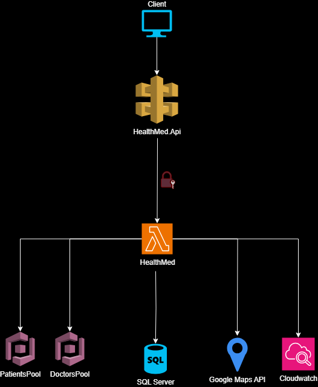

# Hackathon

Esse MVP foi desenvolvido como parte do entregável para o Hackaton do curso 'Pós Tech - Software Architecture', turma SOAT4.

## Pré-requisitos
* [AWS Cloud](https://aws.amazon.com/)							
	* É necessário ter uma conta na AWS para subir a infraestrutura necessária para o projeto.
* [Terraform local](https://www.terraform.io/)
	* Para subir a infraesturura mantida na pasta Terraform desse projeto.

* [Google Cloud](https://cloud.google.com/?hl=pt_br)
	* É necessário gerar uma chave para acessar a Api do Google Maps.

* [Postman](https://www.postman.com/downloads/) - Não obrigatório, mas tem uma collection pronta na pasta raiz do projeto para facilitar os testes.

## Arquitetura do MVP


O MVP foi desenvolvido como um monolito em .NET 8 e publicado como Lambda Function. 
A arquitetura consiste em um API Gateway responsável por disponibilizar os endpoints criados na lambda function, onde alguns dos endpoints não possuem autorização e outros possuem. 
Essa lambda function é integrada a duas User Pools distintas no Cognito, serviço da AWS responsável por lidar com a autenticação dos pacientes e médicos que usarão o software. 
Como base de dados, optei por utilizar o SQL Server por conta da relação existente entre as entidades do projeto. O banco é publicado no RDS da AWS. 
Utilizei o Google Maps API para realizar o cálculo entre a distância do paciente e do médico que está procurando. 
Para salvar os logs de erro da aplicação, utilizei o CloudWatch da AWS.


## Variáveis de ambiente

- SQL_CONNECTION: String de conexão SQL completa, incluindo a base de dados `HealthMed`.
- SQL_CONNECTION_WITHOUT_DB: String de conexão SQL sem especificar a base de dados.
- AWS_DOCTOR_POOL_ID: ID do pool do Amazon Cognito para médicos.
- AWS_DOCTOR_CLIENT_ID_COGNITO: ID do cliente do Amazon Cognito para médicos.
- AWS_PATIENT_POOL_ID: ID do pool do Amazon Cognito para pacientes.
- AWS_PATIENT_CLIENT_ID_COGNITO: ID do cliente do Amazon Cognito para pacientes.
- ACCESS_KEY: Chave de acesso para serviços da AWS.
- SECRET_KEY: Chave secreta para serviços da AWS.
- LOG_GROUP: Grupo de logs no CloudWatch para a aplicação `HealthMed`.
- GCP_KEY: Chave de API do Google Cloud Platform.

## Execução com docker

Para executar com docker, basta executar o seguinte comando na pasta raiz do projeto para gerar a imagem:

``` docker build -t health_med -f .\src\Presentation\HealthMed.Api\Dockerfile . ```

Para subir o container, basta executar o seguinte comando:

```
docker run -e SQL_CONNECTION="Server=mydb.example.com,1433;Database=HealthMed;User Id=sa;Password=YourPassword123;MultipleActiveResultSets=true;TrustServerCertificate=true;" \
-e AWS_DOCTOR_POOL_ID="us-east-1_exampleDoctorPoolId" \
-e AWS_DOCTOR_CLIENT_ID_COGNITO="exampleDoctorClientId" \
-e AWS_PATIENT_POOL_ID="us-east-1_examplePatientPoolId" \
-e AWS_PATIENT_CLIENT_ID_COGNITO="examplePatientClientId" \
-e ACCESS_KEY="EXAMPLEACCESSKEY" \
-e SECRET_KEY="ExampleSecretKey123456" \
-e LOG_GROUP="/HealthMed/Logging" \
-e SQL_CONNECTION_WITHOUT_DB="Server=mydb.example.com,1433;User Id=sa;Password=YourPassword123;MultipleActiveResultSets=true;TrustServerCertificate=true;" \
-e GCP_KEY="ExampleGCPKey" \
-p 8081:8081 -p 8080:8080 health_med
```

Observações: as variáveis de ambiente presentes no comando acima não são reais. As reais devem ser obtidas após a execução do terraform na prórpria AWS.

## Endpoints
Funcionalidades disponíveis.

### Pacientes

- GET /LoginPatient/AuthenticatePatient?Email=email&Cpf=cpf&Password=password - Responsável por autenticar um paciente e retornar o accessToken para poder acessar os outros endpoits dentro de seu contexto.
- GET /Patient/SearchDoctor?patientId=patientId&rating=doctorRating&doctorExpertiseId=expertise&km=kmInNumber - Responsável por buscar todos os médicos disponíveis de acordo com o filtro passado como QueryParams.
- POST /Patient/ScheduleAppointment - Endpoint para solicitar o agendamento de uma consulta com um médico.

### Médicos

- GET /LoginDoctor/AuthenticateDoctor?Crm=crm&Password=password - Responsável por autenticar um médico e retornar o accessToken para poder acessar os outros endpoits dentro de seu contexto.
- POST /Doctor/CreateMedicalAppointmentTime - Responsável por cadastrar um novo horário de consulta disponível para o médico
- GET /Doctor/GetPendingMedicalAppointments/{{doctorId}} - Responsável por retornar todas as consultas pendentes de aprovação de acordo com o id do médico.
- PATCH /Doctor/AcceptAppointment/{{id_solicitação_consulta}}/{{id_horario_disponivel_medico}} - Responsável por fazer o médico aceitar uma consulta solicitada por um paciente e retirá-la da lista de horários disponíveis.

## Publicação

Para subir a infra, basta acessar a pasta "Terraform", presente na raiz do projeto, e executar os comandos do terraform:

- ``` terraform init ```
- ``` terraform apply ```

Lembrando que para executar local é necessario que esteja logado no CLI da AWS localmente com a ACCESS_KEY e SECRET_KEY corretas.

Após a execução do terraform, é necessário gerar a chave no Google Cloud e colocar na váriavel de ambiente "GCP_KEY" na lambda function na AWS.

Para publicar a aplicação, existe uma GitHub Action criada para isso presente [aqui](https://github.com/FernandoMelim/Hackathon/actions/workflows/deploy.yml).
Essa Action é responsável por gerar uma imagem docker, subir ela pra um repositório no ECR e publicar essa imagem na Lambda Function gerada pelo terraform. Para isso funcionar corretamente, é necessário que as variáveis "AWS_ACCESS_KEY_ID" e "AWS_SECRET_ACCESS_KEY" estejam devidamente criadas e configuradas no repositório.
Após esses passos, a aplicação funcionará corretamente através do API Gateway criado pelo terraform. O link do vídeo demonstrando a publicação e funcionamento da API está presente no PDF entregue na plataforma.
